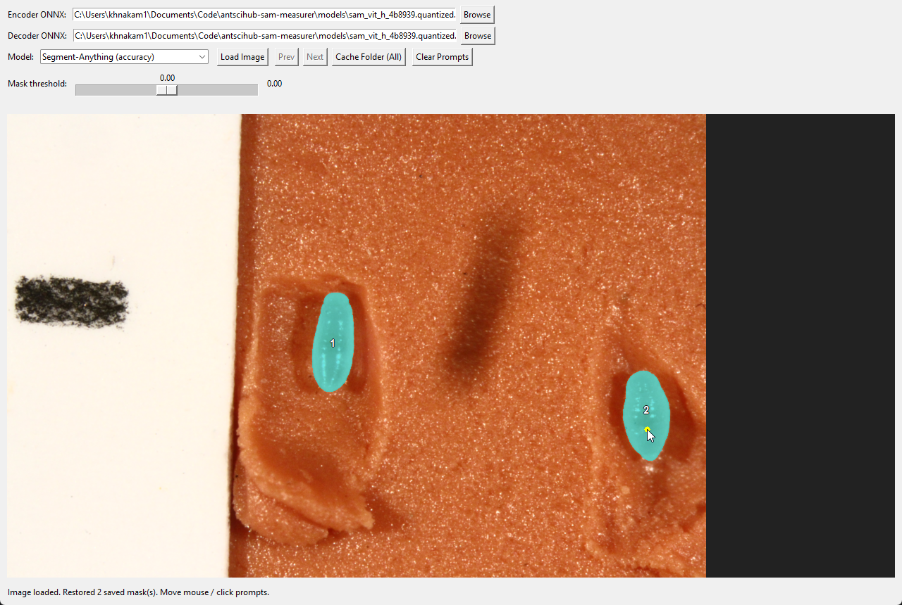

# antscihub-sam-measurer

Lightweight desktop GUI to measure objects in images using Segment Anything (SAM).



## Scope, or, who this tool is for:
This tool is meant to do one thing well: If you have an appropriate job, it will speed up your measurement workflow.

All future versions and features will be in service of that.

TODO: Add a video of the workflow.


## Current features:

**Mask GUI**

| Feature | Description |
|---|---|
| Click-to-segment | Left click runs SAM and commits a mask; right click removes nearby masks or points. |
| Live hover preview | The mask preview follows the mouse before you click. |
| Multiple masks per image | Each committed mask automatically starts a new object session. |
| Ignored regions | `Ctrl`+click marks areas that are subtracted from all masks; `Ctrl`+right-click removes them. |
| Continuous mask mode | Retains only the connected component touching the click point, cutting out stray patches. |
| Selection outline | Optional 1-pixel outline around the active mask; color is selectable from a dropdown. |
| Mask sensitivity | Mouse wheel adjusts the logit threshold live. |
| Zoom and pan | `Ctrl`+wheel to zoom around the cursor, middle-mouse drag to pan, `Shift`+wheel to pan horizontally. |
| Folder navigation | Prev/Next buttons and arrow/A/D/Space keys to step through all images in a folder. |
| Model selection | Four SAM variants: accuracy (ViT-H, default), balanced, speed, and EdgeSAM; picked from a dropdown. |
| Auto-download | Missing ONNX weights are fetched automatically on first use. |
| Autosave | Every committed mask is immediately written to `.sam_clicks.json` and `.sam_clicks.npz` next to the image. |
| Embedding cache | SAM image embeddings are cached to `.sam_embedding.npz` so reopening an image is fast. |

**QC tool**

| Feature | Description |
|---|---|
| Folder browsing | Browse an annotated folder and step through every individual mask. |
| Subject preview | Cropped, zoomed view of each masked subject at its bounding box. |
| Stats sidebar | Scrollable panel showing a mask summary card and all raw metadata fields. |
| Scale-derived values | Real-world area shown when a scale-bar config is present in the folder. |
| Navigation | Color-selectable outline on the preview; keyboard navigation with arrow keys, A/D. |

**Scale bar config**

| Feature | Description |
|---|---|
| Point-and-click calibration | Click two endpoints on a reference scale bar, enter the known length and unit, press Accept. |
| Config preload | Preloads an existing config from the folder so re-editing is non-destructive. |
| Folder scope | One calibration JSON covers all images in the folder. |

**Batch embedding precompute**

| Feature | Description |
|---|---|
| Recursive precompute | Walks a folder tree and precomputes SAM embeddings for every image. |
| Smart skipping | Skips images with a fresh cache; downloads the selected model if needed. |
| CLI options | `--force` to recompute everything; `--summary-json` for a summary output file. |

**CSV export**

| Feature | Description |
|---|---|
| Folder export | Reads the scale-bar config and all annotation JSONs, writes `sam_mask_measurements.csv`. |
| Measurement columns | Image name, mask number, pixel area, `units_per_pixel`, computed area and unit listed first. |
| Full metadata | All annotation metadata appended as extra columns for filtering in a spreadsheet. |

## Future features, or the to-do:

### User friendliness
* Add a video of a typical workflow.
* Integrate different features to one user friendly dash.
* Set up conda wheel or whatever is easiest.

### Feats
* Optional tiled embeddings as part of the precompute phase, based on some relative subject size. Ideally it can get to native resolution detection for subjects that fit.
* Programmatic handoff of click location. If you can auto detect an object (dino), it can try to mask it.
* Jitter look around and matching to example outlines.

## Install

Use Git to pull this project into a folder on your computer. VS Code is the recommended way to work with it because you can keep the folder, terminal, and virtual environment visible in one place.

```powershell
git clone <repo-url> antscihub-sam-measurer
cd antscihub-sam-measurer
code .
```

If you already cloned the folder earlier, open that folder in VS Code and update it with:

```powershell
git pull
```

In the VS Code terminal, create a virtual environment in this folder and install the requirements:

```powershell
python -m venv .venv
.\.venv\Scripts\Activate.ps1
python -m pip install --upgrade pip
python -m pip install -r requirements.txt
```


If setup worked, you should have:

- VS Code open to the `antscihub-sam-measurer` folder.
- A `.venv` virtual environment inside the folder.
- The packages from `requirements.txt` installed.
- A terminal that is ready to run the tools below.

Required packages include `onnxruntime`, `numpy`, `Pillow`, and `gdown`.

Once you have it in vscode, you can click any file and click the play button and it'll prompt you to open folders, which file you want, etc. You can run it typing into terminal if you want though.


## Typical Workflow

1. **Calibrate**: Run `scale_bar_config.py` on the image that contains your scale bar. Click the two ends, enter the known length and unit, and press `Accept`. One config file covers the whole folder. Current logic for 

2. **Precompute** (optional, recommended for large batches): Run `precompute_embeddings.py` on your image folder to cache SAM embeddings before you start clicking.

3. **Annotate**: Open `sam_hover_mask_gui.py`, load each image, and click objects to create and save masks.

4. **Export**: Run `folder-to-csv.py` on the folder to combine the scale calibration with all saved mask data into one CSV.

## Run the Mask GUI

Start the main click tool from the VS Code terminal:

```powershell
python sam_hover_mask_gui.py
```

The first launch may look like it is hanging while it downloads SAM model weights. Watch the VS Code terminal: the download progress should appear there. The default model is `Segment-Anything (accuracy)`, which uses the quantized ViT-H ONNX weights. Expect about 665 MB of model files for the default model. Weights are stored in `models/`, so this should only happen once per model.

After the model is ready, open an image and start clicking objects.

SAM runs internally at a 1024-pixel model size. For best precision, use images where the object you care about is large enough to be well represented at that scale. If a full image is very large or contains many small subjects, consider cropping or cutting it into tiles before measuring; this often improves detection more reliably than sensitivity tweaks.

You can choose other model weights from the model dropdown:

- `Segment-Anything (accuracy)`: default, best quality for most tasks.
- `Segment-Anything (balanced)`: middle ground.
- `Segment-Anything (speed)`: smaller/faster.
- `Segment-Anything (Edge)`: lightweight EdgeSAM option.

## Mask GUI Controls

- `Ctrl` + mouse wheel: zoom in and out around the cursor.
- Hold middle mouse button and drag: pan around the image.
- Left click: assign a mask for the current object.
- Right click: remove a nearby mask or point.
- `Ctrl` + left click: assign an ignored region, which is subtracted from masks.
- `Ctrl` + right click: remove a nearby ignored region.
- Mouse wheel: increase or decrease mask sensitivity.
- `Shift` + mouse wheel: pan horizontally while zoomed.
- `c`: clear prompts.

Sensitivity is the `Mask threshold` value. Typically you want to keep it at `0.00`. Increasing or decreasing sensitivity can subtly adjust which pixels the model includes, but if you need accuracy, cropping or tiling the image is usually the better move.

## Autosaved Mask Data

As soon as a mask is calculated, the tool saves annotation files next to the image:

- `<image>.sam_clicks.json`: human-readable metadata.
- `<image>.sam_clicks.npz`: compact bit-packed mask data.
- `<image>.<hash>.sam_embedding.npz`: cached SAM embedding for faster reopening.

The JSON has the information needed to inspect or export the mask: image name, image size, model name, click location, mask number, pixel area, bounding box, threshold/sensitivity, continuous-mask setting, ignored-region metadata, and other mask statistics. The exact list of captured fields is visible by opening the JSON file directly, or by opening the folder in the QC tool.

Run the QC viewer with:

```powershell
python sam_mask_qc_tool.py "path\to\image-folder"
```

The QC tool lets you quickly step through masks, inspect the masked subject, view the stats table, and see scale-derived values when a scale-bar config is available.

## Batch Processing

When you load or browse images in the GUI, you may notice a slow `Computing embedding` step. That embedding is cached per image and model, but the first pass can take a while.

To compute embeddings ahead of time for a whole folder tree, run:

```powershell
python precompute_embeddings.py --source-folder "path\to\image-folder"
```

This recursively scans the selected folder and all child folders, downloads the selected model if needed, skips fresh caches, and writes the same embedding files the GUI uses. Use `--force` if you intentionally want to recompute everything.

Optional summary output:

```powershell
python precompute_embeddings.py --source-folder "path\to\image-folder" --summary-json "path\to\summary.json"
```

## Scale Bar Config

If you need real-world units, run the scale-bar config tool on an image that contains a known scale bar:

```powershell
python scale_bar_config.py --source-input "path\to\image-folder\scale-bar-image.jpg"
```

Click the two ends of the scale bar, enter the known length and unit, then press `Accept`. This writes:

- `<image-stem>.scale_bar_config.result.json`

Typically you want one scale-bar config file per image folder. The CSV exporter and QC tool will use it to compute relative values such as area in `mm^2` or length in `mm`. If the source folder already has a scale-bar config, the scale-bar helper opens the matching reference image and preloads its saved points, known length, and unit.

## Export Measurements

After annotating images and creating a scale-bar config, export measurements for a folder:

```powershell
python folder-to-csv.py --source-folder "path\to\image-folder"
```

This reads the newest `*.scale_bar_config.result.json` in the folder and all `*.sam_clicks.json` files in that folder, then writes:

- `sam_mask_measurements.csv`

The CSV keeps the measurement columns first, including image name, mask/click number, pixel area, `units_per_pixel`, computed area, and computed area unit. It also appends flattened metadata from the scale-bar config, the annotation JSON, and each mask record.

## Where Information Lives

For an image named `larva_001.jpg`, you might see:

- `larva_001.jpg`: original image.
- `larva_001.jpg.sam_clicks.json`: readable mask metadata.
- `larva_001.jpg.sam_clicks.npz`: compact binary mask archive.
- `larva_001.jpg.<hash>.sam_embedding.npz`: cached SAM embedding.
- `scale_reference.scale_bar_config.result.json`: folder scale calibration.
- `sam_mask_measurements.csv`: exported folder-level measurement table.

Examples of useful fields:

- Pixel area for a mask: `records[].mask_area_px`.
- Bounding box: `records[].mask_bbox_xyxy`.
- Click location: `records[].seed_point_xy`.
- Sensitivity at click time: `records[].threshold_at_click`.
- Model used: `records[].model_name`.
- Scale conversion: `scale_bar.units_per_pixel` in the scale-bar config.
- Computed CSV area: `computed_area` and `computed_area_unit`.

The JSON files are the detailed record. The CSV is the convenient spreadsheet. The QC tool is the fastest way to visually verify that a mask and its stats are the ones you meant to measure.

## License and Attribution

This project is licensed under CC BY-NC 4.0. It was heavily inspired by Annolid, which is copyright (c) 2024 Computational Physiology Laboratory and is also distributed under CC BY-NC 4.0.

I made this project because I could not figure out how to get Annolid working for my workflow, but Annolid's methods were clear enough to guide this smaller, focused SAM measurement tool.

See [LICENSE](LICENSE) for the full local attribution notice.
